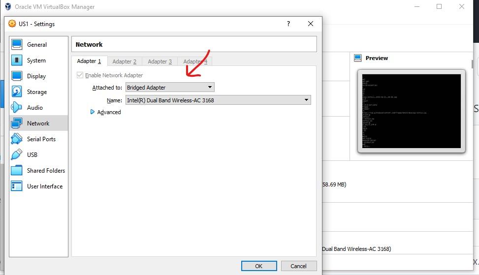
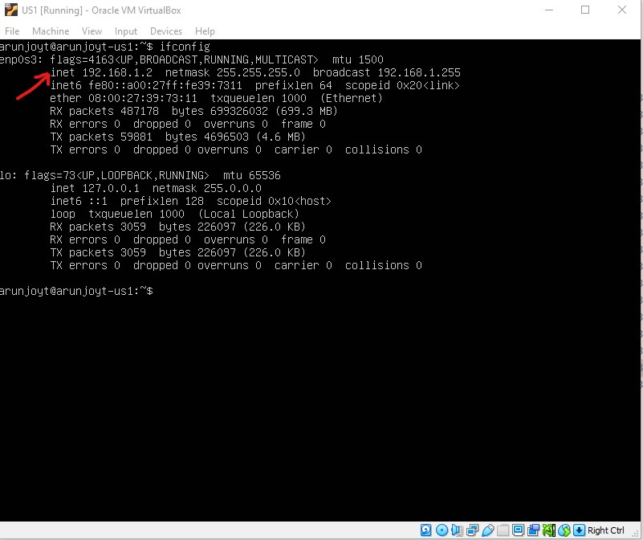
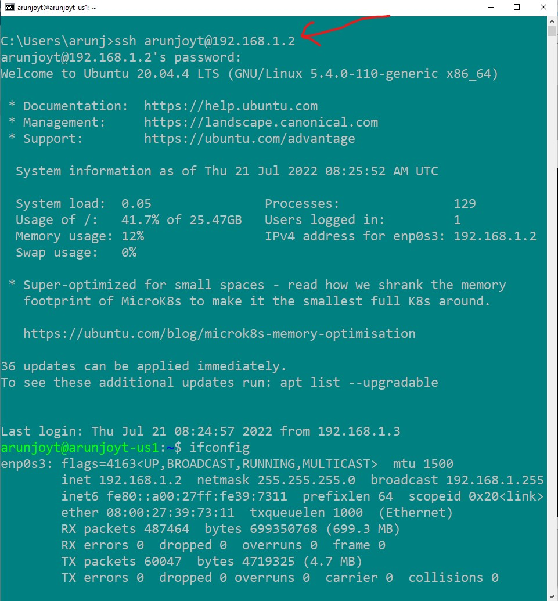

## How to ssh from Windows 10 to Ubuntu-server on Virtualbox?
1. Install Ubuntu-server on Virtualbox with all default settings.
2. Go to "Settings--> Network" of of Ubuntu-server on Virtualbox. Set the "Attached to" to "Bridged Adapter".
3. Get the ip address of ubuntu-server using ifconfig command.
4. Launch cmd prompt on host Windows10 and fire ssh username@ipaddress. 
